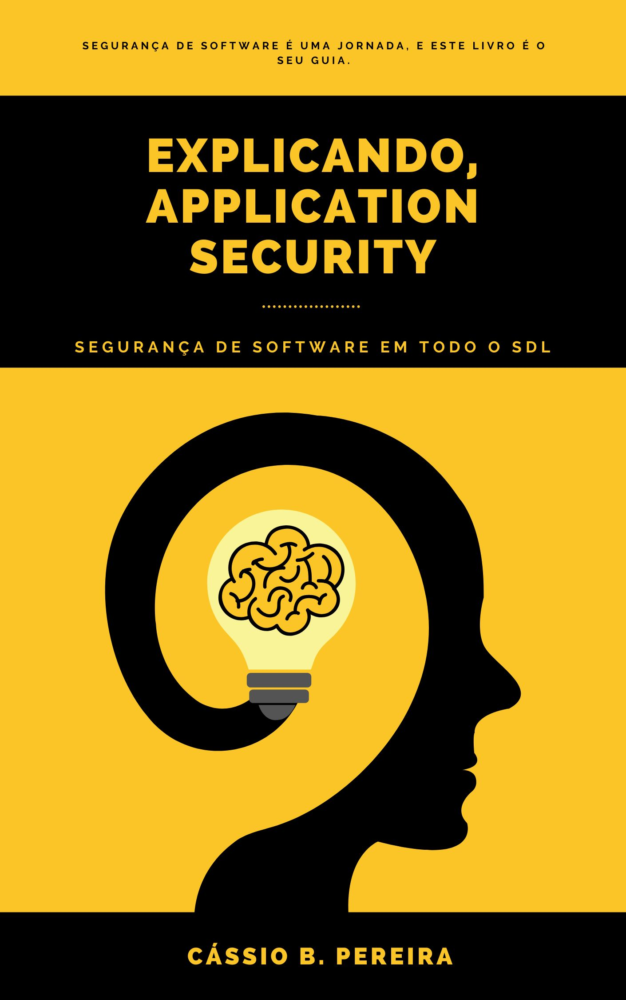

O projeto do livro Explicando, Application Security é diferente de tudo que já fiz.

Basicamente eu vou escrever o livro num processo open e colaborativo.

**Open**, pois você que [fizer a reserva na pré venda](https://book.stripe.com/bIY4iT8h78OkbbG000) poderá ler os capítulos durante o processo de produção, ou seja, enquanto escrevo. Não vai precisar esperar o livro versão final ficar pronto. Claro, quando ficar pronto você receberá primeiro o acesso à todos os formatos disponíveis, e também a atualizações futuras.

**Colaborativo**, você que [fizer a reserva na pré venda](https://book.stripe.com/bIY4iT8h78OkbbG000), também poderá sugerir capítulos (temas / tópicos) para que eu escreva. Ou seja, além dos [capítulos](https://cassiodeveloper.com.br/livro/capitulos/) base do livro, você poderá ainda ler sobre os capítuos que você sugeriu. Claro que, irei fazer uma curadoria na lista de sugestões mas, não é fantástico? Um livro escrito com base no que os leitores pediram?

# Objetivos

Meu principal objetivo com este livro é disseminar [ainda mais](https://www.youtube.com/@CassioBatistaPereira) a cultura de desenvolvimento seguro. É muito raro encontrar este tipo de conteúdo em português e até mesmo em inglês, já que o mercado aumenta a demanda a cada dia, faltam profissionais para atuar nesta área.

Outro ponto importante é, nossa vida é controlada por softwares, eles precisam estar o mais seguro possível. Por tanto, é importante que todos envolvidos no ciclo de desenvolvimento de software (SDL), leiam e tenham acesso à este tipo de conteúdo.

# Importante

O preço final do livro, será bem maior que o de [pré venda](https://book.stripe.com/bIY4iT8h78OkbbG000), por tanto eu sugiro que você compre agora mesmo e não corra o risco de pagar mais caro depois.

E se você leu até aqui, toma ainda 5% off. Só utilizar o cupom 5OFF [neste link](https://book.stripe.com/bIY4iT8h78OkbbG000).